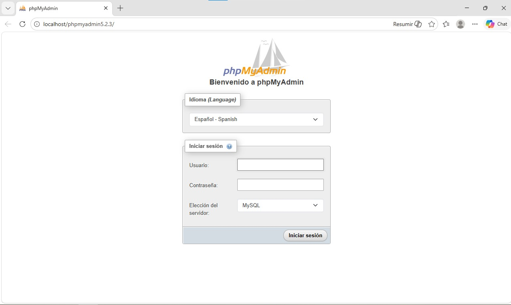
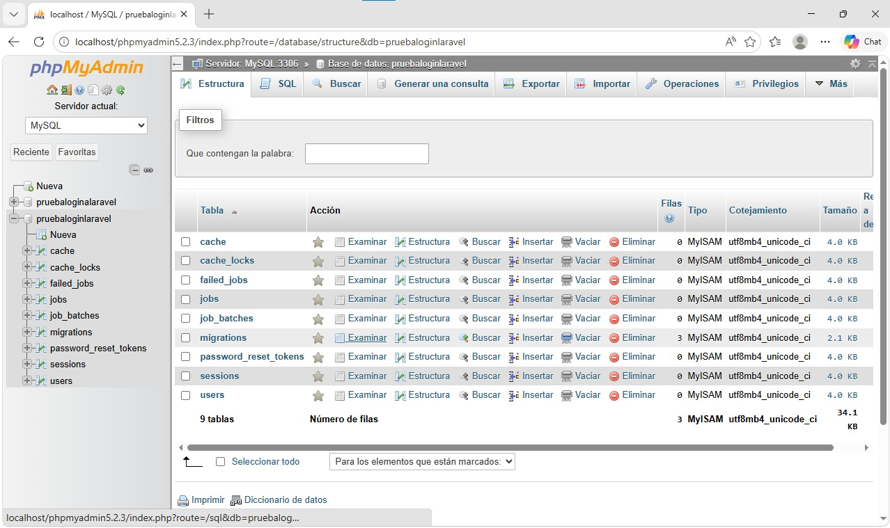
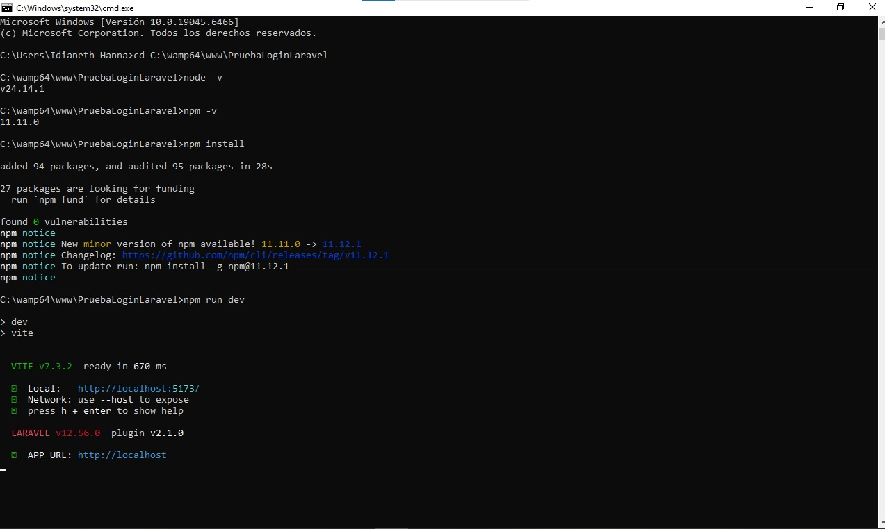
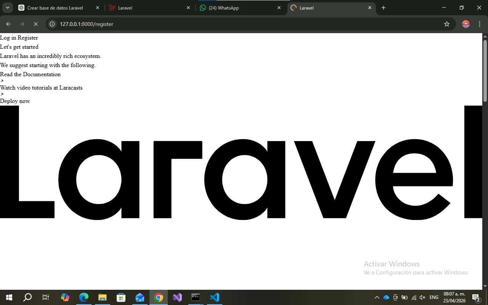
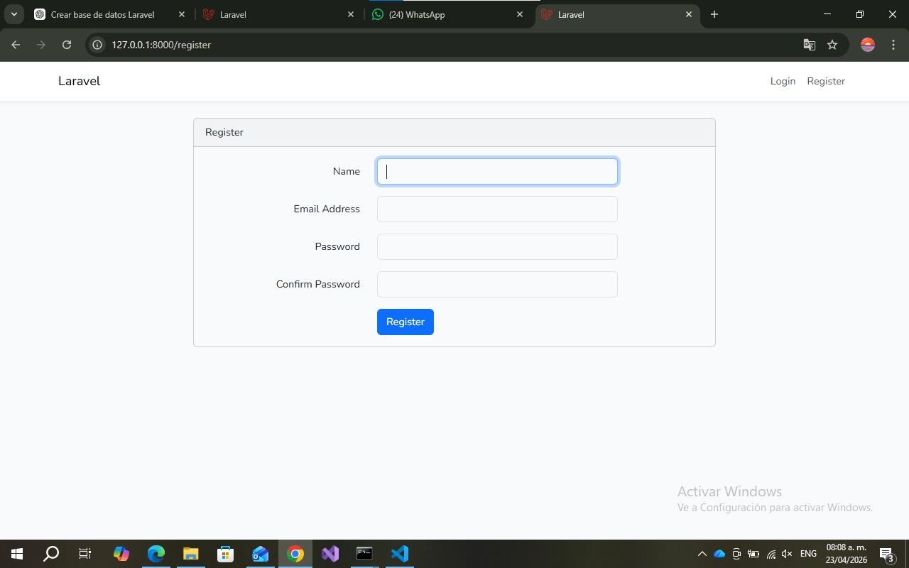

# Proyecto Login en Laravel

## Descripción
Este proyecto consiste en la implementación de un sistema de autenticación utilizando Laravel.

## Objetivo del laboratorio

Implementar un sistema de autenticación en Laravel que permita el registro e inicio de sesión de usuarios, comprendiendo la configuración del entorno y el uso de migraciones.

## Requisitos
- PHP 8+
- Composer
- Laravel
- Wamp
- VS Code
- MySQL
- Node.js
- Sistema Operativo windows

## Comandos utilizados
### Verificación del entorno
- composer --version
- php --version
## Creación del proyecto
cd C:\wamp64\www
laravel new PruebaLoginLaravel
## Configuración de la base de datos (.env)
DB_CONNECTION=mysql
DB_HOST=127.0.0.1
DB_PORT=3306
DB_DATABASE=pruebaloginlaravel
DB_USERNAME=root
DB_PASSWORD=
## Migraciones
- php artisan migrate
## En caso de errores
php artisan config:clear
php artisan migrate:fresh

## Instalación de autenticación
- composer require laravel/ui
- php artisan ui bootstrap --auth
## Instalación de dependencias
- npm install
- npm run dev
## Ejecución del proyecto
- php artisan serve

## Arquitectura MVC

El proyecto se basa en la arquitectura Modelo-Vista-Controlador (MVC):

- Modelo (Model): Se encarga de la gestión de los datos y la interacción con la base de datos.
- Vista (View): Representa la interfaz gráfica que el usuario visualiza.
- Controlador (Controller): Gestiona la lógica del sistema y conecta el modelo con la vista.

## Base de Datos

Se utilizó MySQL como sistema de gestión de base de datos.
La conexión se configuró en el archivo .env y las tablas fueron creadas mediante migraciones.
- php artisan migrate

Tablas generadas:
users
cache
jobs
migrations

## Resultado






## Errores y soluciones
Error "Specified key was too long"
Solución: Se agregó en AppServiceProvider:
use Illuminate\Support\Facades\Schema;
public function boot(): void
{
    Schema::defaultStringLength(191);
}

Error "npm no se reconoce"
Solución: Se instaló Node.js correctamente y se reinició la terminal.

Error de que tuve que forzar el PHP
Solucion: set PATH=C:\wamp64\bin\php\php8.2.29;%PATH%
Error de bloqueo
Solucion: Set-ExecutionPolicy RemoteSigned

## Referencias
https://laravel.com/docs
https://stackoverflow.com
https://www.youtube.com

## Fecha de Ejecución
15 de abril de 2026

```md
---

## Información del Estudiante
Este laboratorio ha sido desarrollado por el estudiante de la Universidad Tecnológica de Panamá:
Nombre: Idianeth Hanna
Correo: idianeth.hanna@utp.ac.pa
Curso: Desarrollo de software VII
Instructor: Irina Fong

